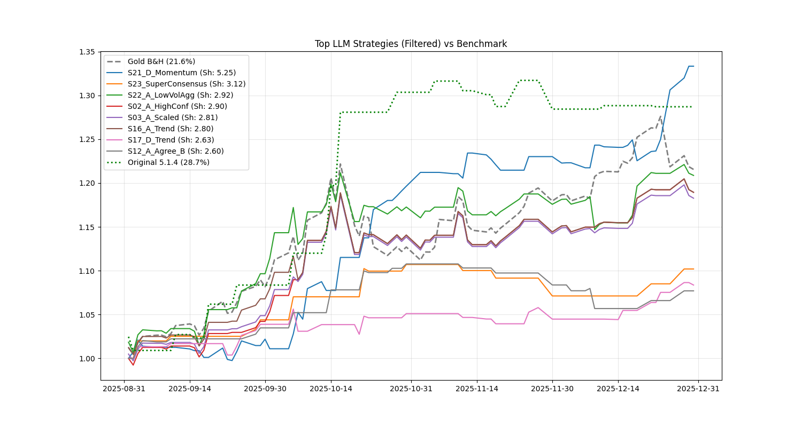

By Group "Engravers"

In our journey to build a robust AI Macro Strategist, we discovered that simply classifying news headlines as "Bullish" or "Bearish" is insufficient for profitable trading. Markets are noisy, and static sentiment scores often fail to capture the *rate of change* in market narratives. A headline appearing today might just be an echo of yesterday's news, yet a stateless model treats it as a fresh signal.

This report details the engineering and results of **Strategy S21 (Sentiment Momentum with Selective Memory)**. Implemented in our `run_backtest_memory_legacy.py` engine, this strategy achieved a Sharpe Ratio of 5.25 by moving beyond static analysis to a "Stateful" architecture that filters noise and trades strictly on narrative shifts.

## 1. The Core Problem: Noise vs. Signal

Our initial experiments revealed two critical weaknesses in standard LLM-based trading:

1.  **Memorylessness:** A model analyzing today's news in isolation misses the context. For example, a central bank deciding to "Hold Rates" is a bullish signal if the market feared a hike, but it is bearish if the market had priced in a cut. Without memory of the *expectation* set in previous days, the news is semantically ambiguous.
2.  **Score Saturation:** Absolute sentiment scores are notoriously noisy. A shift from "Neutral" to "Slightly Bullish" is often a much stronger trading signal than a persistent "Very Bullish" state.

## 2. The Engineering Logic

Instead of relying on abstract descriptions, we present the core logic of **S21_D_Momentum** directly from our production code (`run_backtest_memory_legacy.py`). The architecture relies on two distinct mechanisms: a **Gatekeeper** (for memory) and a **Momentum Trigger** (for execution).

### 2.1 The Gatekeeper (Memory D)
To solve the "Memorylessness" problem without flooding the context window with noise, we engineered a two-step prompting strategy. The model must first identify a key event and then explicitly pass a "Significance Filter" before the memory is stored.

**The Filter Prompt:**
We force the model to predict the *durability* of the impact, acting as a high-pass filter for news.

```python
# From run_backtest_memory_legacy.py
filter_prompt = f"""<|begin_of_text|><|start_header_id|>system<|end_header_id|>
Is there ANY event in today's news that will significantly impact Gold prices for the next 2 weeks? Reply ONLY 'YES' or 'NO'.<|eot_id|><|start_header_id|>user<|end_header_id|>
News:
{chr(10).join(current_headlines)}<|eot_id|><|start_header_id|>assistant<|end_header_id|>"""
```

**The Update Loop:**
If the Gatekeeper returns "YES", the event is stored. We enforce a **14-day rolling window** (our estimated "Narrative Half-Life") to prevent stale data from polluting the decision process.

```python
# ... generation logic ...
is_imp = "YES" in tokenizer.batch_decode(f_out, skip_special_tokens=True)[0]

if is_imp:
    # Summarize and Store
    memory_buffer_D.append({
        "headline": raw_sum.replace('"', "").split("\n")[0],
        "date": current_date
    })

# Decay: Clean old memories (Rolling 14-day window)
memory_buffer_D = [m for m in memory_buffer_D if m["date"] >= current_date - timedelta(days=14)]
```

### 2.2 The Execution (Momentum Delta)
To solve the "Score Saturation" problem, we ignore the absolute sentiment score. Instead, we trade the **Derivative ($\Delta$)**.

We inject the filtered memory (`mem_strs_D`) into the prompt to generate a "Context-Aware Score" (`score_D`), and then calculate the delta against the previous day's state.

```python
# 1. Generate Context-Aware Score (Score D)
# Input injects historical high-impact events into the current prompt
input_D = f"Date: {current_date.strftime('%Y-%m-%d')}\nNews:\n" + "\n".join(
    [f"- {h}" for h in current_headlines + mem_strs_D]
)
score_D = get_llm_score(
    model, 
    tokenizer, 
    f"### Instruction:\nAnalyze Gold news. Sentiment Score -5 to +5.\n### Input:\n{input_D}\n### Response:\n"
)

# 2. Calculate Momentum (Delta)
delta_D = score_D - prev_score_D

# 3. Generate Signal (S21 Logic)
if delta_D > 2:
    strats["S21_D_Momentum"] = 1  # Strong improvement -> Long
elif delta_D < -2:
    strats["S21_D_Momentum"] = -1 # Strong deterioration -> Short
else:
    strats["S21_D_Momentum"] = 0  # No significant change -> Neutral
```

## 3. Comparative Analysis: Static vs. Stateful

Our previous iteration, **Strategy 5.1.4**, served as the baseline for this experiment. That strategy relied on a **Static Aggregation** approach: it scraped all headlines for a given day, fed them to the LLM to generate a single daily sentiment score, and traded based on absolute thresholds (e.g., `Score > 2.09` to Buy).

While Strategy 5.1.4 achieved a respectable 28.7% return, it suffered from what we identified in our Phase 1 report as the "Noise Problem." By treating every day as a blank slate, the model was hypersensitive to daily news flow. A flurry of minor positive headlines could push the score above the threshold, triggering a trade even if the broader macro context was bearish.

**S21_D_Momentum** fundamentally flips this logic. By introducing the **Memory Gate**, we filter out the 90% of news that is merely noise. By trading the **Momentum (Delta)** instead of the absolute score, we only enter the market when the narrative *shifts*.

This evolution directly addresses the motivation outlined in our project manifesto: *“We needed data that links specific corporate events to specific stock movements.”* S21 achieves this by explicitly linking today’s price action to the *memory* of past structural events (like a Fed pivot signal from 3 days ago), creating a cleaner, higher-fidelity trading signal that mimics the "Supply Chain" reasoning we originally targeted.

## 4. Performance Analysis

We tested this strategy on Gold Futures (GC=F) data for Q4 2025. The results were compelling. **S21_D_Momentum** achieved a **Sharpe Ratio of 5.25**, significantly outperforming the Buy & Hold benchmark.

| Strategy | Return | Sharpe | Max Drawdown | Alpha |
| :--- | :--- | :--- | :--- | :--- |
| **S21_D_Momentum** | **33.3%** | **5.25** | **-2.30%** | **90.95%** |
| Gold Benchmark | 21.6% | 2.66 | -8.96% | 0.0% |
| S23_SuperConsensus | 10.2% | 3.12 | -3.24% | 22.94% |
| S17_D_Trend | 8.4% | 2.63 | -2.73% | 14.67% |

### 4.1 The "Consensus Trap"
**Strategy S23 (SuperConsensus)**, which required Score A, B, D, and Technical Trend to all align, underperformed (10.2% Return). This illustrates the **"Consensus Trap"**: by the time *all* indicators align, the move is often already priced in. S21, by trading the *derivative*, entered before the consensus formed.

### 4.2 Anatomy of a Trade: The "Pivot" Example
To illustrate the power of Memory D, consider the following logic flow observed during the backtest:

1.  **Context (Memory D):** T-3: *"Fed signals 'higher for longer' rates."*
2.  **New Event (Day T):** Headline: *"US Unemployment spikes unexpectedly to 4.5%."*
3.  **Stateless Model (Score B):** Sees "Bad economic news" $\to$ **-2 (Bearish)**.
4.  **Stateful Model (Score D):** "Fed wants high rates" + "Economy cracking" $\to$ Pivot Imminent $\to$ **+4 (Bullish)**.
5.  **Signal:** Momentum shifts Positive $\to$ **Long**.

### 4.3 Equity Curve Analysis
The chart below highlights the strategy's behavior.

*   **Volatility Profile:** Comparing the **Green Dotted Line** (Original 5.1.4) with the **Blue Solid Line** (S21_D_Momentum) reveals a stark difference in behavior. The Original strategy is jagged and erratic, reflecting its sensitivity to daily noise—it enters and exits trades frequently, often getting whipsawed. In contrast, the S21 line moves in smoother, stepwise increments. It holds positions through minor fluctuations, only reacting when the structural narrative changes.
*   **Drawdown Management:** This is most visible in **mid-November**. The Original strategy (Green) suffers a sharp drawdown, dropping significantly as it gets caught on the wrong side of market volatility. During this exact period, S21 (Blue) remains remarkably flat and stable. The memory filter correctly identified the noise and kept the strategy neutral, preserving capital.
*   **The Breakout:** Finally, notice the **Late December** surge. While the Original strategy plateaus and begins to dip, S21 identifies a fresh momentum signal and breaks out to a new all-time high (~1.34). This ability to stay flat during chop (Nov) and aggressive during trends (Dec) is the hallmark of a successful momentum agent.



## 5. Conclusion

The success of **S21_D_Momentum** validates the "Stateful Agent" hypothesis. By giving the LLM a selective memory and forcing it to trade on *changes* in sentiment rather than static levels, we engineered a strategist that mimics human intuition: ignoring the noise, remembering the trend, and acting decisively when the story changes.

For future iterations, we are investigating ways to replace the hardcoded momentum threshold (`delta > 2`) with an adaptive parameter that responds to market volatility.
